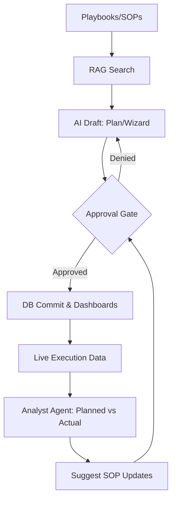
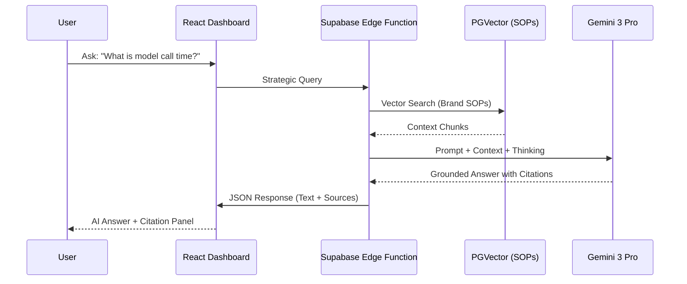

# FashionOS — Product Requirements Document (PRD) v1.0
**The Neural Operating System for the Modern Maison.**

---

## TABLE OF CONTENTS
1. [Executive Summary](#1-executive-summary)
2. [Problem Statement](#2-problem-statement)
3. [Target Users](#3-target-users)
4. [Directory Structure & Routes](#4-directory-structure--routes)
5. [Core Features (No AI Required)](#5-core-features-no-ai-required)
6. [Advanced AI Features](#6-advanced-ai-features)
7. [Use Cases & Real World Examples](#7-use-cases--real-world-examples)
8. [User Stories](#8-user-stories)
9. [User Journeys](#9-user-journeys)
10. [Workflows (System + User)](#10-workflows-system--user)
11. [Mermaid Diagrams](#11-mermaid-diagrams)
12. [Website Pages](#12-website-pages)
13. [Dashboard Pages](#13-dashboard-pages)
14. [Wizards (Multi-Step)](#14-wizards-multi-step)
15. [Chatbots](#15-chatbots)
16. [Data Model](#16-data-model)
17. [AI Functions (Function Calling Contracts)](#17-ai-functions-function-calling-contracts)
18. [Success Criteria](#18-success-criteria)
19. [Risks + Constraints](#19-risks--constraints)
20. [Suggested Improvements](#20-suggested-improvements)
21. [Implementation Notes](#21-implementation-notes)
22. [Phased Implementation Plan](#22-phased-implementation-plan)

---

## 1. EXECUTIVE SUMMARY
FashionOS is an AI-powered operating system designed to orchestrate the high-stakes production, events, and revenue streams of luxury fashion brands. Built on **Gemini 3** and grounded in specialized **Playbooks (SOPs)** and **Multi-collection RAG**, the platform transforms artisanal creative vision into precise, cited, and automated operational execution. It ensures brand DNA integrity while maximizing multi-channel ROI through asset-level attribution and a closed-loop learning system.

---

## 2. PROBLEM STATEMENT
Fashion brands currently operate using a "Fragmented Tool Soup" (Notion, Airtable, HubSpot, Spreadsheets, and WhatsApp). This leads to:
- **Knowledge Leakage**: Creative intent is lost between planning and on-set execution.
- **Operational Chaos**: Lack of Standard Operating Procedures (SOPs) for events and shoots results in expensive delays.
- **Attribution Blindness**: Difficulty in proving ROI to sponsors (Beauty, Auto, Tech) due to disconnected data.
- **Scale Friction**: Onboarding new teams or vendors requires manual hand-holding without a central source of truth.

---

## 3. TARGET USERS
| Role | Goal | Pain Point |
| :--- | :--- | :--- |
| **Fashion Designers** | Scale creative vision without losing DNA. | Administrative overwhelm. |
| **Creative Directors** | Orchestrate high-fidelity campaigns and shoots. | Communication gaps with crew. |
| **Event Producers** | Manage NYFW/PFW runway shows and activations. | Managing 100+ vendors in real-time. |
| **Sponsorship Managers**| Secure and report on luxury partnerships. | Manual ROI report generation. |
| **Media & PR Teams** | Maximize editorial placement and press coverage. | Fragmented press lists and kits. |
| **Executives / Founders**| Monitor Maison growth and performance indices. | Lack of real-time operational health data. |

---

## 4. DIRECTORY STRUCTURE & ROUTES

### 4.1 Recommended Directory Structure (Domain-Driven)
```text
/
├── components/
│   ├── ui/                 # Atomic design (stateless)
│   ├── layouts/            # Public, App, FullWidth
│   └── shared/             # SEO, Nav, Footer, AI Sidebar
├── contexts/               # Global State (Auth, Project, Intel)
├── pages/                  # Route Entry Points
│   ├── marketing/          # Public SEO content
│   ├── sponsors/           # Vertical partner hubs
│   └── app/                # Authenticated Workspace
│       ├── brand/          # :brandId scoped
│       ├── events/         # :eventId scoped
│       ├── production/     # :shootId scoped
│       ├── crm/            # :contactId scoped
│       └── global/         # Dashboards, Settings, Chat
├── services/               # Gemini 3 & Edge Logic
├── utils/                  # JSON helpers, formatting
└── docs/                   # Architectural Governance
```

### 4.2 Route Map
- **Public**: `/`, `/features`, `/pricing`, `/demo`, `/solutions/:vertical`, `/sponsors/:category`, `/platform-overview`
- **App**: `/dashboard`, `/playbooks`, `/brand/:brandId/profile`, `/events/:eventId/live`, `/shoots/:shootId/execution`, `/crm/:contactId`, `/sponsors/:sponsorId/roi`

### 4.3 Semantic Params Law
All dynamic routes must use semantic IDs: `:brandId`, `:eventId`, `:shootId`, `:contactId`, `:sponsorId`, `:vendorId`, `:venueId`. Generic `:id` is prohibited.

### 4.4 Context-Aware NotFound
- `marketing/*` -> Public 404 (Brand Hero focus).
- `dashboard/*` -> App 404 (Preserving Sidebar and Concierge access).

---

## 5. CORE FEATURES (NO AI REQUIRED)
| Feature | Description | Screens | Data Table |
| :--- | :--- | :--- | :--- |
| **SOP Editor** | Manual creation of multi-phase Playbooks. | `PlaybooksDashboard` | `sop_docs`, `sop_sections` |
| **Event Planner** | Task list with dependencies and deadlines. | `EventsDashboard` | `events`, `tasks` |
| **Shoot Hub** | Scene management and crew assignments. | `ShootsDashboard` | `shoots`, `scenes` |
| **Asset Library** | DAM for storing high-res campaign imagery. | `AssetsLibrary` | `assets` |
| **CRM Hub** | Contact and account relationship tracking. | `CRMDashboard` | `crm_contacts`, `accounts` |
| **Sponsor Tracking** | Pipeline for partnership deliverables. | `SponsorsDashboard` | `sponsorships`, `placements` |
| **Commerce Node** | Shopify/Ticketing integration baseline. | `CommerceDashboard` | `orders`, `tickets` |

---

## 6. ADVANCED AI FEATURES
| Job | Gemini Model | Tools Used | Safety Gate |
| :--- | :--- | :--- | :--- |
| **Grounded RAG** | Pro 3 | pgvector + Thinking | Citation Verification |
| **SOP Architect** | Pro 3 | Structured Output | Controller Approval |
| **Critical Path Recovery**| Pro 3 | Search + Code Exec | Risk Sentinel |
| **Sponsor Matching** | Flash 3 | Search Grounding | Human-in-loop |
| **Aesthetic Audit** | Flash 3 | URL Context + Image | Scorer Gate |
| **Live HUD Feedback** | Flash 3 | Interactions API | Approvals Log |

---

## 7. USE CASES & REAL WORLD EXAMPLES
| Case | Scenario | Outcome | Metrics |
| :--- | :--- | :--- | :--- |
| **Runway Show** | NYFW event with 40 models and 20 vendors. | Zero delay in run-of-show. | -2h prep time. |
| **DTC Launch** | Multi-channel social campaign for new silk. | 100% aesthetic consistency. | +22% engagement. |
| **Sponsor Proof** | Automotive brand integration at gala. | Automated high-fidelity ROI. | 100% contract fulfillment.|
| **Recovery** | Lighting vendor cancels 24h before shoot. | AI sources grounded replacement. | 0 days lost. |
| **Press Kit** | Post-show media distribution. | Automated kit gen from SOP data. | < 5 min dist. |

---

## 8. USER STORIES
- **CRM**: As a Brand Manager, I want AI to summarize my relationship history with a Vogue editor so I can personalize my pitch.
- **Events**: As an Event Producer, I want AI to generate a run-of-show based on the "Gala SOP" to prevent task gaps.
- **Shoots**: As a Creative Director, I want AI to audit captured frames against brand DNA to ensure compliance.
- **Sponsors**: As a Partnership Lead, I want AI to calculate the earned media value of a sponsor logo placement.
- **Media**: As a PR Lead, I want AI to identify the top 5 influencers most likely to attend a sustainable fashion show.
- **Automations**: As an Ops Lead, I want a recovery automation that triggers when a critical path task is 4h late.

---

## 9. USER JOURNEYS
### 9.1 Runway Show (End-to-End)
1. `Event Wizard` ingestion -> `SOP Selection` (Runway SOP).
2. `AI Planner` generates 12-week task schedule with dependencies.
3. `Vendor Scout` sources lighting and sound via Maps grounding.
4. `Live Mode` triggers cues for audio/visual nodes on show night.
5. `Analyst Agent` generates post-show ROI report for sponsors.

---

## 10. WORKFLOWS (SYSTEM + USER)
### 10.1 AI-Assisted Task Creation
- **Trigger**: New event created in `/events`.
- **System**: Retriever Agent pulls "Events SOP" from pgvector.
- **AI**: Gemini 3 Pro proposes 40 tasks.
- **User**: "Accept All" or "Edit Steps."
- **DB**: Commits to `tasks` and `run_of_show` tables.

---

## 11. MERMAID DIAGRAMS

### 11.1 Flowchart: Operational Learning Loop


### 11.2 Sequence Diagram: RAG Grounding


---

## 12. WEBSITE PAGES
- **Landing**: Hero (One OS for the Maison), Value Props, AI Capabilities.
- **Features**: Dedicated sections for Playbooks, DAM, CRM, and Event Node.
- **Solutions**: Verticals (Runway, DTC, Wholesale, Agency).
- **Pricing**: Maison (Solo), Collective (Team), Heritage (Enterprise).
- **Platform Overview**: Visual card-based sitemap of the entire ecosystem.

---

## 13. DASHBOARD PAGES
| Dashboard | Primary KPIs | Top Actions | AI Sidebar Action |
| :--- | :--- | :--- | :--- |
| **Overview** | Momentum, ROI, Safety Score | Create Event, Plan Shoot | "Summarize Priorities" |
| **CRM** | CLV, Sentiment Index | Add Contact, Log Pitch | "Generate Pitch Draft" |
| **Live Event** | Run-of-show Clock, Task % | Trigger Cue, Log Issue | "Predict Delay Impact" |
| **Shoots** | DNA Compliance, Shot List %| Upload Asset, Assign Crew | "Audit Visual Drift" |

---

## 14. WIZARDS (MULTI-STEP)
| Wizard | Steps | Primary Output |
| :--- | :--- | :--- |
| **Event Wizard** | Concept -> Date -> Venue -> SOP | Full Project Schedule |
| **Recovery Wizard** | Delay Detected -> Impact Calc -> Options | Alternative Vendor/Schedule|
| **Sponsor Onboard** | Sector -> Value -> Deliverables | Partnership Contract Draft |

---

## 15. CHATBOTS
- **Concierge**: (Global) Handles sitemap navigation and "Answer with Citations."
- **CRM Assistant**: (CRM Pages) Summarizes leads and researches target accounts via Search Grounding.
- **Set Assistant**: (Native Audio) Provides eyes-free feedback on lighting/pose during shoots.

---

## 16. DATA MODEL (TABLES)
| Table | Purpose | Fields |
| :--- | :--- | :--- |
| `brands` | Identity Root | id, name, dna_pillars, style_guide |
| `sop_docs` | Truth Repository | id, brand_id, title, content_hash |
| `events` | Project Node | id, sop_id, venue_id, start_time, status |
| `tasks` | Execution Node | id, event_id, role, dependencies, status |
| `assets` | Digital Asset | id, shoot_id, s3_url, dna_score, attribution_id |
| `ai_runs` | Governance Log | id, model, prompt_tokens, approval_status |

---

## 17. AI FUNCTIONS (CONTRACTS)
- `generate_ros(event_id, sop_id)`: Creates JSON run-of-show.
- `audit_asset(asset_id, dna_snapshot)`: Returns compliance score 0-100.
- `scout_vendors(location, category)`: Maps + Search grounding for studio/rentals.
- `simulate_roi(sponsor_id, campaign_id)`: EMV calculation based on reach data.

---

## 18. SUCCESS CRITERIA
- **Precision**: 95%+ citation accuracy for SOP-based questions.
- **Velocity**: -40% manual data entry in Event and Shoot setup.
- **Integrity**: 0 assets published with < 80% DNA compliance (Safety Gate).
- **Revenue**: 2x increase in sponsor renewal rate via clear ROI reporting.

---

## 19. RISKS + CONSTRAINTS
- **Hallucination**: AI suggesting non-existent event venues (Mitigated by Maps Grounding).
- **Privacy**: Brand collection leaks (Mitigated by Node-level encryption).
- **Reliance**: System downtime during live shows (Mitigated by Offline-First sync).

---

## 20. SUGGESTED IMPROVEMENTS
1. Direct 3D set simulator.
2. Blockchain-verified authenticity tokens for assets.
3. Multi-touch attribution for retail conversion.
4. AI-driven model casting affinity scores.

---

## 21. IMPLEMENTATION NOTES
- **Frontend**: React + Tailwind. Use `createHashRouter` for deployment stability.
- **Backend**: Supabase. Use Edge Functions for all Gemini 3 API handshakes.
- **Realtime**: Use Postgres Changes for the "Run-of-show Live" HUD.

---

## 22. PHASED IMPLEMENTATION PLAN

### Phase 1: Core Foundation (MVP)
- Deliverables: CRUD for Events/Shoots, Basic DAM, Manual Playbook editor.
- **DoD**: User can manually plan and finish a shoot.
- **Verification**: 100% of CRUD operations tested.

### Phase 2: AI-Assisted (Gemini Flash)
- Deliverables: SOP-driven task generation, AI Press Kits, Search Grounding.
- **DoD**: Event wizard creates a task list with 0 manual typing.
- **Verification**: Citation check on 50 sample SOP queries.

### Phase 3: Automation & Logic (Gemini Pro)
- Deliverables: Critical Path Recovery, ROI Forecaster, Guardian Vision Audit.
- **DoD**: System detects a delay and proposes a grounded solution.
- **Verification**: Regression test on all manual flows.

### Phase 4: Learning Maison
- Deliverables: Learning loop (actual vs planned), Proactive Strategic Pivot alerts.
- **DoD**: System suggests an SOP edit based on a previous event's friction logs.
- **Verification**: Validation of "Improvement Proposal" logic.

---
**End of PRD.**