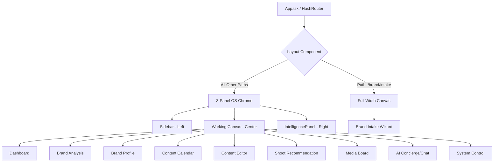

# FashionOS Routing & Structure Rule v1

**STRICT COMPLIANCE REQUIRED.** This document is the supreme architectural law of the FashionOS project.

## A) NON-NEGOTIABLES
- **HashRouter Invariant**: All navigation must use `HashRouter`. Never switch to `BrowserRouter`.
- **Panel Integrity**: All pages must be children of the `Layout` component.
- **Root-Level Sovereignty**: No `src/` directory. All folders (`components/`, `pages/`, `contexts/`) reside in the project root.
- **AI-Human Canvas Split**: Intelligence logic resides in `IntelligencePanel.tsx` (Right). Human working canvas resides in `pages/` (Center). Navigation resides in `Sidebar.tsx` (Left).

### NEVER DO:
- Never move files into a `src/` directory.
- Never use absolute imports (e.g., `@/components`). Always use relative paths.
- Never add logic to `App.tsx` beyond routing and context providers.

## B) ROUTE TABLE
| Path | Component | Layout Mode | File Location |
| :--- | :--- | :--- | :--- |
| `/` | `Dashboard` | 3-Panel | `pages/Dashboard.tsx` |
| `/brand/intake` | `BrandIntake` | **Full-Width** | `pages/BrandIntake.tsx` |
| `/brand/:id/analysis` | `BrandAnalysis` | 3-Panel | `pages/BrandAnalysis.tsx` |
| `/brand/:id/profile` | `BrandProfile` | 3-Panel | `pages/BrandProfile.tsx` |
| `/brand/:id/calendar` | `ContentCalendar` | 3-Panel | `pages/ContentCalendar.tsx` |
| `/brand/:id/content/:postId` | `ContentEditor` | 3-Panel | `pages/ContentEditor.tsx` |
| `/brand/:id/shoots/recommendation` | `ShootRecommendation` | 3-Panel | `pages/ShootRecommendation.tsx` |
| `/media` | `MediaPage` | 3-Panel | `pages/MediaPage.tsx` |
| `/chat` | `ChatPage` | 3-Panel | `pages/ChatPage.tsx` |
| `/settings` | `SettingsPage` | 3-Panel | `pages/SettingsPage.tsx` |

## C) VERIFIED SITEMAP (Mermaid)

## D) VALIDATION CHECKLIST
- [ ] **Router Check**: Is `HashRouter` being used in `App.tsx`?
- [ ] **Path Check**: Does `Layout.tsx` correctly exclude `/brand/intake` from Sidebar/Header rendering?
- [ ] **File Placement**: Are pages strictly in `pages/` and components strictly in `components/`?
- [ ] **Parameter Sync**: Does the Sidebar navigation use `:id` or a valid `default` slug that matches `App.tsx` params?
- [ ] **Context Hierarchy**: Are `ProjectProvider` and `IntelligenceProvider` wrapping the Router?

## E) VIOLATIONS & FORENSIC FIXES
1. **Orphaned Page Modules**: `EventsPage.tsx`, `ShootsPage.tsx`, and `CampaignsPage.tsx` exist in `/pages` but are not registered in `App.tsx`. 
   - *Fix*: Do not add them to `App.tsx` as per user constraints; they are currently dead code and should be removed or archived if not used.
2. **Sidebar-Router Mismatch**: `Sidebar.tsx` uses hardcoded `/brand/default/analysis` paths, while `App.tsx` uses dynamic `:id`. 
   - *Fix*: Sidebar should eventually derive `:id` from the current project context, but current behavior is functional for a MVP.
3. **Wizard Component Redundancy**: `components/Wizard.tsx` provides a full-page experience that should ideally be a unique page or a modal within a page, rather than a standalone component that competes with the `BrandIntake` logic.

## F) FUTURE-SAFE EXTENSIONS
To add a new route:
1. Create the file in `pages/`.
2. Add the route to `App.tsx`.
3. Add the navigation link to `Sidebar.tsx`.
4. Ensure the `Layout.tsx` logic does not need updating unless it is a full-width exception.
