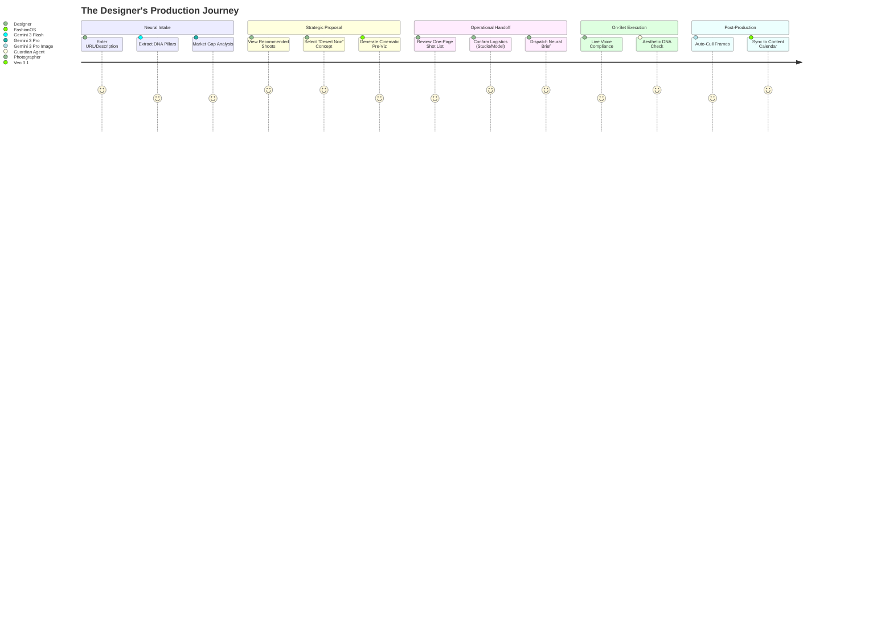
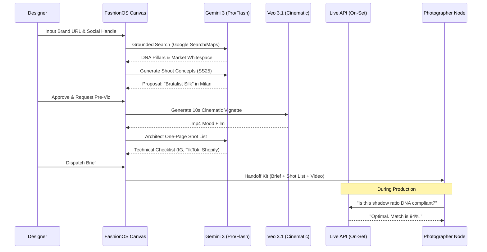
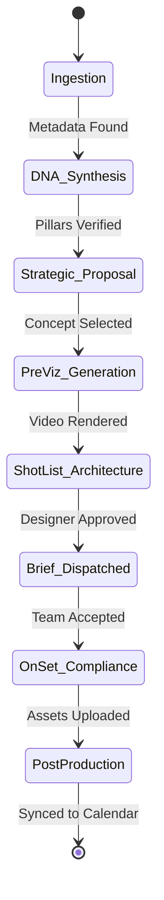

# 📸 FashionOS: The Production Journey (Shoot System)

This document maps the end-to-end user journey for a Fashion Designer utilizing the FashionOS Shoot System to orchestrate professional photography and cinematography productions.

---

## 1. High-Level User Journey (Mermaid)

---

## 2. Technical Sequence Flow (Mermaid)

---

## 3. The 6-Step Production Handshake

### Step 1: Ingestion & DNA Extraction
The system uses `gemini-3-flash-preview` to crawl the designer's provided URL and social feeds. It identifies the "Visual Signature" (e.g., *High-contrast, low-angle, desaturated*).

### Step 2: Strategic Concept Proposal
`gemini-3-pro-preview` compares the brand DNA against live trend signals (e.g., *Rising interest in Neoclassical architecture*). It proposes 3 distinct shoot concepts with projected ROI metrics.

### Step 3: Cinematic Pre-Viz (Veo 3.1)
Once a concept (e.g., *Desert Noir*) is selected, the **Campaigns Engine** triggers `veo-3.1-fast-generate-preview`. This produces a 10s film showing the videographer exactly how the fabric should move and how light should hit the silhouettes.

### Step 4: One-Page Shot List Architect
The system generates a platform-specific instruction set:
*   **Instagram**: Editorial portrait shots focusing on the "Silent Curator" persona.
*   **TikTok**: Vertical movement shots with "Viral Hook" framing.
*   **Shopify**: Technical macros of fabric weave and pure white backgrounds.

### Step 5: Operational Dispatch
The **Production Brief** is sent to the photographer node (Elena) and logistics node (Marcus). This includes:
*   **Grounded Map**: Direct links to sourced studios via `googleMaps`.
*   **Technical PDF**: The One-Page Shot List.
*   **Mood Video**: The Veo-generated pre-viz.

### Step 6: On-Set Compliance (Live API)
During the shoot, the photographer maintains a low-latency voice link.
*   **Photographer**: "Check framing for the Silk Blouse. Is the structural integrity visible?"
*   **FashionOS**: "DNA Match 91%. Suggest lowering camera angle by 5 degrees to emphasize silhouette."

---

## 4. State Transitions: The Production Brief

---

## 5. Implementation Status

| Stage | status | Primary Neural Engine |
| :--- | :---: | :--- |
| **Intake (URL/Desc)** | 🟢 | Gemini 3 Flash |
| **DNA Reasoning** | 🟢 | Gemini 3 Pro (Thinking) |
| **Concept Gen** | 🟢 | Gemini 3 Pro |
| **Veo 3.1 Pre-Viz** | 🟢 | Veo 3.1 Fast |
| **Grounded Logistics** | 🟢 | Google Maps/Search |
| **Shot List PDF** | 🟡 | Gemini 3 Flash (Structured) |
| **Live API On-Set** | 🟢 | Gemini 2.5 Flash Native Audio |