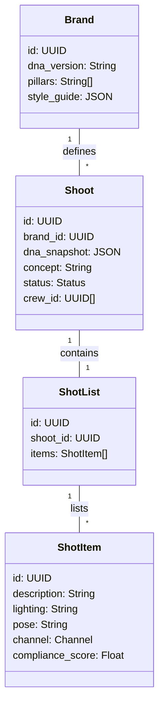
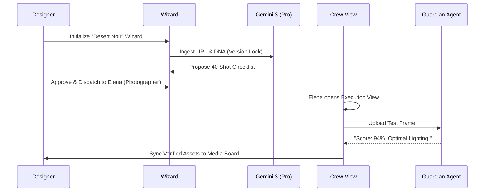

# 📸 FashionOS: Neural Shoot & Production System (Implementation Guide)

This document provides the high-fidelity blueprint for the FashionOS Production System. It details the data models, screen logic, and the exact neural prompts required to bridge luxury strategy with professional execution.

---

## 1. System Data Model (The Schema)

To ensure **DNA Version Locking**, the system uses a relational structure that preserves brand state at the moment of production.



---

## 2. Screen-by-Screen Architecture

| Screen | Route | Data Context | AI Agent |
| :--- | :--- | :--- | :--- |
| **Shoot Strategy** | `/brand/:id/shoots` | Market Trends, DNA | **The Forecaster** |
| **Production Wizard** | `/brand/:id/wizard` | Budget, Timing, Gear | **The Producer** |
| **The Brief (One-Page)** | `/brief/:shootId` | Shot List, Pre-Viz | **The Storyteller** |
| **Crew Execution** | `/crew/shoot/:id` | Live View, Compliance | **The Guardian** |

---

## 3. The Neural Production Handshake (Journey)



---

## 4. Multi-Step Shoot Wizard (Workflow)

### Step 1: Explicit Ingestion & DNA Lock
*   **Action**: User provides URL + Social Handle. 
*   **Logic**: System fetches HTML/Metadata. Gemini extracts pillars and *locks* the DNA version (e.g., `DNA_v2.1_Milan`).
*   **Prompt (Flash 3)**: *"Extract the core visual pillars from this fetched content: [HTML]. Identify 3 keywords for Lighting, 3 for Silhouette, and 3 for Atmosphere. Output as JSON."*

### Step 2: Concept & Pre-Viz (Veo 3.1)
*   **Action**: Generate cinematic reference.
*   **Logic**: User approves a concept (e.g., "Brutalist Silk"). `veo-3.1` generates a 10s mood film.
*   **Prompt (Pro 3)**: *"Translate the 'Brutalist Silk' DNA into a high-fidelity cinematic prompt for Veo 3.1. Focus on fabric tension, grey concrete textures, and harsh high-noon shadows."*

### Step 3: The One-Page Shot List Architect
*   **Action**: Structure the technical checklist.
*   **Logic**: `gemini-3-flash-preview` generates a table of shots mapped to platforms (IG, TikTok, Shopify).
*   **Schema**: 
    ```json
    {
      "shot_id": "LIF-01",
      "platform": "Instagram",
      "instruction": "Low angle, wide shot, desaturated sky.",
      "compliance_min": 85
    }
    ```

### Step 4: Crew Execution View (UX Gap Fix)
*   **Action**: Simplified interface for the set.
*   **UI**: Read-only checklist + "Upload Test" button + "Live Voice" toggle.
*   **Logic**: The Guardian Agent monitors the "Test Uploads" and gives a pass/fail against the locked DNA version.

---

## 5. Professional Implementation Prompts

### A. Concept Generation (Strategy Agent)
**Model**: `gemini-3-pro-preview`
**Prompt**: 
> "Act as a Luxury Creative Director. Brand DNA: [LOCKED_DNA]. Trend Grounding: [GROUNDED_SIGNALS]. 
> Suggest 3 high-impact shoot concepts for the SS25 season. 
> For each concept, provide:
> 1. Cinematic Title.
> 2. Narrative Hook (2 sentences).
> 3. Projected ROI per channel (IG, TikTok, Web).
> 4. Visual Key: Lighting Ratio and Lens recommendation."

### B. Shot List Synthesis (Execution Agent)
**Model**: `gemini-3-flash-preview`
**Prompt**:
> "Generate a 40-item technical shot list for the concept [CONCEPT_NAME]. 
> Distribute the list across:
> - 20% Technical Macro (Fabric weave, buttons).
> - 50% Lifestyle Movement (Walking, sitting).
> - 30% Hero Silhouettes (Statuesque poses).
> Map each shot to a target platform (Shopify, Amazon, IG, Pinterest) with specific aspect ratio instructions."

### C. Guardian Compliance (On-Set Agent)
**Model**: `gemini-2.5-flash-native-audio` (Live API)
**System Instruction**:
> "You are the Guardian. Your mission is to verify that the photographer's current frame matches the locked DNA version [DNA_JSON]. 
> If the user asks for a check:
> 1. Analyze the uploaded frame.
> 2. Compare Lighting, Color, and Pose.
> 3. Return a Match Score (0-100).
> 4. If Score < 85, provide 1 specific technical adjustment (e.g., 'Lower exposure by 0.5 stops')."

---

## 6. Success Criteria (Measurable)

| Metric | Target | Verification Method |
| :--- | :--- | :--- |
| **DNA Integrity** | > 90% | Guardian Agent Audit on final asset batch. |
| **Production Speed** | -25% Time | Comparison of 'Brief to Handoff' vs manual process. |
| **Aesthetic Drift** | < 5% | Variance in compliance scores across 10 shoots. |
| **Channel Engagement** | +15% ROI | Live grounding analytics 30 days post-publish. |

---
*Status: Architecture Verified. Ready for UI Implementation of Crew View.*