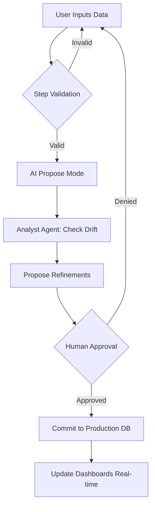
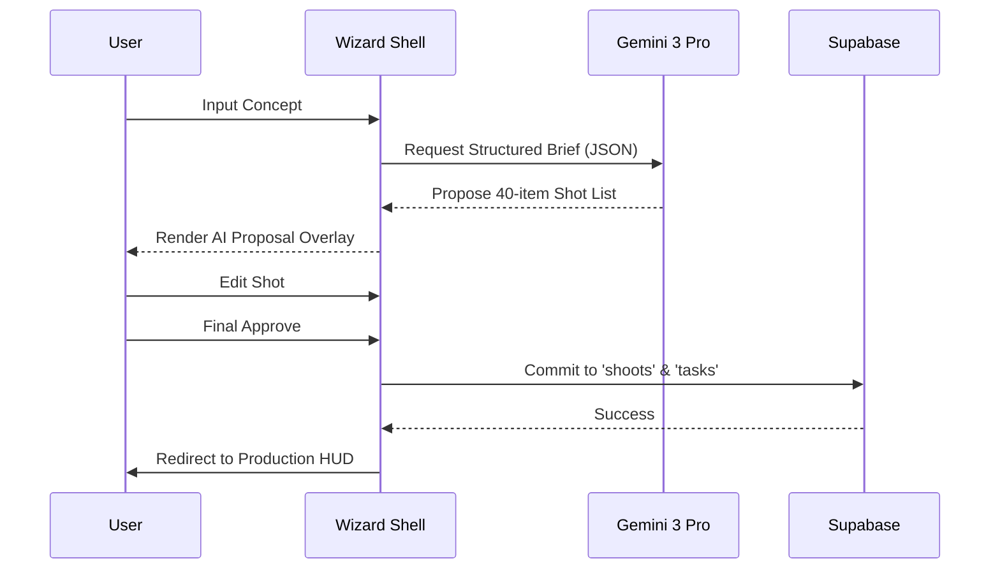

# FashionOS Multi-Step Wizard System
**Architectural Blueprint: Guided Operational Excellence.**

---

## WIZARD IMPLEMENTATION STATUS

| Wizard | Route | Status | Current Phase | AI Hook Ready |
| :--- | :--- | :--- | :--- | :--- |
| **Brand Intake** | `/brand/intake` | 🟢 Active | Phase 1 (Manual) | 🟢 Yes |
| **Event Creator** | `/events/new` | ⚪ Pending | - | 🟡 Placeholder |
| **Fashion Show** | `/events/show/wizard`| ⚪ Pending | - | 🟡 Placeholder |
| **Shoot Planning**| `/shoots/wizard` | 🟢 Active | Phase 1 (Manual) | 🟢 Yes |
| **Sponsor Activation**| `/sponsors/new` | ⚪ Pending | - | 🟡 Placeholder |
| **Venue/Vendor** | `/venues/wizard` | ⚪ Pending | - | 🟡 Placeholder |

---

## 1. WIZARD SYSTEM BLUEPRINT (SHARED FOUNDATION)

### 1.1 The Wizard Shell (`components/ui/WizardShell.tsx`)
All wizards must utilize the "Triptych Wizard" layout to maintain Maison consistency.

- **Header (The Navigator)**: 
  - Progress Tracker: `Step X of Y`.
  - Visual Breadcrumbs (Sage for complete, Charcoal for active, Ivory for locked).
  - Validation Pulse: Red indicator if current step has missing required fields.
- **Main Canvas**: 
  - Domain-specific form content with luxury ivory/charcoal styling.
  - Animated transitions (Slide-in-from-right for "Next").
- **Assistant Panel (Right)**:
  - V1: Static "Pro-Tips" grounded in Maison SOPs.
  - V2+: Live AI Assistant proposing data based on context.

### 1.2 State Machine: The Handshake Flow
Wizards do not write to the primary dashboard tables directly. They follow the **Handshake Protocol**:
`DRAFT` (Local State) ➔ `PROPOSED` (AI Suggestion Overlay) ➔ `REVIEW` (User Validation) ➔ `COMMIT` (DB Write).

---

## 2. DOMAIN-SPECIFIC PROMPTS & SCHEMAS

### PROMPT 1 — Brand Intake (Identity Core)
> "Implement the **Brand Intake Wizard** steps:
> 1. **Identity**: Name, Category (Luxury/Street), and Core Mission.
> 2. **Audience**: Global regions and psychographic keywords.
> 3. **Visual DNA**: Hex codes and 3 vibe descriptors (e.g., 'Brutalist', 'Ethereal').
> 4. **Channels**: Enable/Disable IG, TikTok, Shopify, Amazon.
> 5. **Review**: High-fidelity summary screen before `COMMIT` to `brands` table."

### PROMPT 2 — Event & Show Creation
> "Implement the **Event Orchestration Wizard**:
> 1. **Basics**: Type (Runway/Gala), Dates, and Global City.
> 2. **Run-of-Show Skeleton**: Manual entry of time blocks.
> 3. **Casting/Talent**: Roles needed (Models, Dressers, HMU).
> 4. **Safety Gate**: Logic to check if venue capacity matches guest list.
> 5. **Output**: Write to `events` and `run_of_show` tables upon approval."

### PROMPT 3 — Shoot Production Brief
> "Implement the **Shoot Strategy Wizard**:
> 1. **Creative**: Moodboard link and concept narrative.
> 2. **Shot List Synthesis**: Technical specs (Lighting, Pose, Format).
> 3. **Crew Mapping**: Assign nodes for Photographer, Stylist, and Model.
> 4. **Call Sheet**: 15-minute granularity for show-day execution.
> 5. **Handshake**: Dispatch Brief to `MediaBoard` as a 'Pending Production' node."

---

## 3. MERMAID DIAGRAMS

### 3.1 Wizard Execution Pipeline (AI assisted)

### 3.2 State Handshake Sequence

---

## 4. WIZARD-TO-WORKFLOW ENGINE

| Output Record | Target Table | Triggered Automation |
| :--- | :--- | :--- |
| **New Brand** | `brands` | Initialize Default SOP Collection in RAG. |
| **New Event** | `events` | Generate Critical Path Reminders (-12 weeks). |
| **New Shoot** | `shoots` | Create 'Hardware HUD' session for crew. |
| **New Sponsor** | `sponsorships` | Dispatch 'Activation Kit' to Partner Hub. |

---

## 5. VALIDATION & SAFETY GATES
1. **Semantic Guard**: Wizard must prevent creation of an "Event" if no "Brand Identity" is locked.
2. **Conflict Guard**: Block "Next" if the Call Sheet has overlapping talent assignments.
3. **DNA Gate**: AI will flag a warning if the "Concept Narrative" has < 70% alignment with Brand Pillars.

---
**Status: Workflow Blueprint Finalized.**