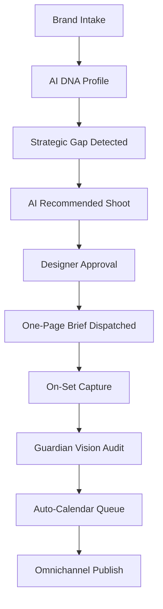
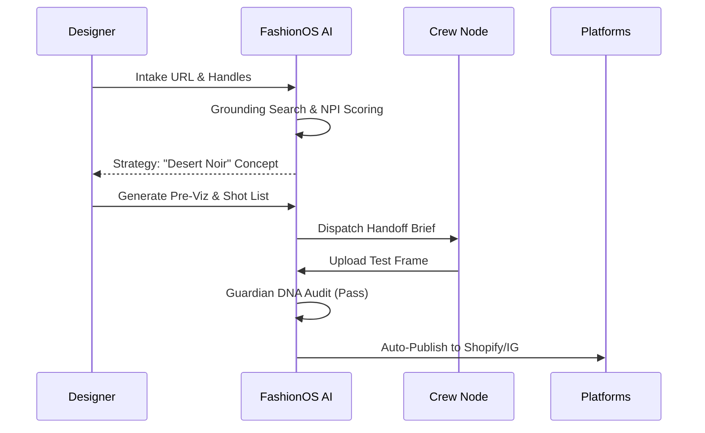

# 📸 FashionOS Shoot System: Strategic Production Blueprint
**Status: Blueprint | Phase: End-to-End Orchestration**

---

## 1. EXECUTIVE SUMMARY
The **FashionOS Shoot System** is the neural bridge between creative vision and commercial conversion. Designed for fashion designers and creative directors, it transforms raw brand DNA into a high-fidelity production pipeline. By synchronizing Gemini 3’s reasoning with Veo 3.1’s cinematic synthesis, the system ensures that every frame shot is optimized for specific channels—maximizing reach on TikTok while maintaining luxury integrity on Vogue.

---

## 2. DESIGNER INTAKE & BRAND PROFILE
The foundation of the system is the **Neural Ingestion Loop**.

### 2.1 The Intake Flow
- **Inputs**: Brand Name, Mission, Type (Luxury/Street), URL, and Social Handles (IG/TikTok/Pinterest/Shopify/Amazon).
- **Gemini Ingestion**: Uses the **URL Context Tool** to crawl the existing Maison site.
- **Deep Grounding**: Performs a multi-node search via **Google Search** to verify:
    - **Shopify/Amazon Presence**: Detects SKU density, review sentiment, and catalog structure.
    - **Pinterest Clusters**: Identifies user-generated moodboards and aesthetic patterns.
    - **WhatsApp/Commerce Nodes**: Detects direct-to-consumer (DTC) friction points.

### 2.2 Reliability Matrix
| Feature | Detection Method | Reliability | Metadata Stored |
| :--- | :--- | :--- | :--- |
| **Platform Presence** | Grounded Search | 98% | Store IDs, API Endpoints |
| **Aesthetic Pillars** | Vision Analysis (Flash) | 92% | Hex Codes, Lighting Ratios |
| **Competitor Gaps** | Thinking (Pro) | 85% | Market Position, Price Delta |

---

## 3. BRAND INTELLIGENCE & SCORING
A weighted index that dictates the "Neural Strategy" for upcoming shoots.

### 3.1 Scoring Matrix (NPI - Neural Performance Index)
| Metric | Weight | Logic |
| :--- | :--- | :--- |
| **Brand Clarity** | 20% | Consistency of "Verbal DNA" across all grounded sources. |
| **Website UX** | 15% | LCP, conversion paths, and mobile-first responsiveness. |
| **E-com Readiness** | 25% | Presence of high-fidelity macros, white-background parity, and sizing logs. |
| **Social Velocity** | 20% | Growth rates on IG/TikTok (1mo vs 6mo delta). |
| **Content Consistency** | 20% | Aesthetic drift detection (variance in color/lighting). |

---

## 4. CORE SHOOT SYSTEM (MANUAL BASELINE)
Operational tools for the human-led phase.

- **Shoot Manager**: Manual entry for title, date, location, and crew (Photographer/Model).
- **Product Selector**: Pulls from the grounded Shopify/Amazon catalog.
- **Channel Picker**: Toggle buttons for target platforms (e.g., "This shoot is for TikTok + Amazon").
- **Asset Board**: Folder structure for RAW ingestion and human approval.

---

## 5. AI-ASSISTED PLANNING (ADVANCED)
The "Intelligence Panel" layer using Gemini 3 models.

### 5.1 Advanced Capabilities
- **Strategic Thinking**: `gemini-3-pro-preview` uses 4,096 tokens to identify "Content Gaps" (e.g., "You have high-street reach but zero luxury-editorial presence").
- **Cinematic Pre-Viz**: `veo-3.1-fast` generates 10-second mood films for the photographer to understand fabric movement requirements.
- **Grounded Sourcing**: **Google Maps Grounding** identifies studios and lighting rentals within 5km of the shoot location.

---

## 6. CHANNEL-SPECIFIC STRATEGY MATRIX

| Channel | Format | Model | Background | Intent |
| :--- | :--- | :--- | :--- | :--- |
| **Instagram** | 4:5 Portrait | Yes | Editorial/Urban | Engagement/Brand |
| **TikTok** | 9:16 Video | Yes | Natural/Lo-fi | Viral Reach |
| **Shopify** | 3:4 Image | Optional | Pure White (#FFF)| Sales Conversion |
| **Amazon** | 1:1 Image | No | Pure White (#FFF)| Technical Search |
| **Pinterest** | 2:3 Vertical | No | Atmospheric | Discovery/Mood |
| **Vogue** | Landscape | Yes | High-Contrast | Heritage Equity |

---

## 7. THE ONE-PAGE NEURAL SHOT LIST
The primary output for the crew. A structured PDF/Digital HUD.

- **Header**: DNA Snapshot (v2.1 Milan) + Pre-Viz Link.
- **Table**: 
    - `SCENE`: (e.g., Brutalist Concrete)
    - `SHOT`: (e.g., Macro Weave @ f/2.8)
    - `TARGET`: (Shopify / IG)
    - `GOAL`: (High-Trust Conversion)

---

## 8. AUTO-PUBLISH & GROWTH LOOP
Seamless deployment via **n8n / Postiz** integration.

1. **Trigger**: Asset marked "Approved" in Media Board.
2. **AI Step**: `Gemini 3 Flash` generates 3 persona-specific caption variants.
3. **Safety Gate**: `Guardian Agent` checks for DNA compliance scores > 90%.
4. **Action**: `Supabase Edge Function` dispatches payload to Postiz/Shopify APIs.

---

## 9. GROWTH AGENTS (THE MAISON SQUAD)
| Agent | Input | Output | Action |
| :--- | :--- | :--- | :--- |
| **Strategist** | Market Trends | Campaign Themes | Propose 90-day Roadmap |
| **Analyst** | Social Sentiment | Performance Delta | Suggest "Strategic Pivot" |
| **Optimizer** | RAW Assets | Crop/Color Suggestion | Align frames to Channel Best-Practice |
| **Controller** | System Intent | Approval Request | Gate DB writes |

---

## 10. VISUAL RAG SYSTEM (IMAGE INTELLIGENCE)
- **Database**: `pgvector` on Supabase storing 10,000+ high-performing luxury archetypes.
- **Logic**: During shoot planning, the system embeds the "Creative Narrative" and retrieves similar "High ROI" shots from the RAG to suggest lighting/pose combinations.

---

## 11. WORKFLOWS & AUTOMATIONS

---

## 12. CORE VS ADVANCED VS INNOVATIVE

| Feature | Category | Description | Business Impact |
| :--- | :--- | :--- | :--- |
| **Manual Brief** | Core | Human-written shoot instructions. | Baseline Ops. |
| **Veo Pre-Viz** | Advanced | Cinematic video previews for crew. | -80% Prep Time. |
| **Live Voice Set** | Innovative | Native Audio link for on-set advice. | 0% Aesthetic Drift. |

---

## 13. MERMAID DIAGRAMS

### 13.1 Designer-to-AI Sequence

---

## 14. SUCCESS METRICS
- **Content Reuse**: Target 5+ channel outputs per 1 shot.
- **Engagement Lift**: Target +20% delta via "Neural Golden Hour" posting.
- **Production Velocity**: Target 24h from "Brief to Ready-to-Post."

---

## 15. RISKS & CONSTRAINTS
- **Hallucination Risk**: Managed by strict **Grounding** with Search/Maps.
- **DNA Security**: All RAG data is node-encrypted (Maison Isolation).
- **Latency**: Heavy Veo/Thinking cycles handled via asynchronous background workers.

---

## 16. IMPLEMENTATION NOTES
- **Frontend**: Multi-step wizard using `WizardShell.tsx` layout.
- **Backend**: Supabase Edge Functions with `node-fetch` for Postiz/n8n webhooks.
- **Storage**: RAG vectors stored in `vector` column of `brands` table.

---
**Status: Workflow Blueprint Finalized.**