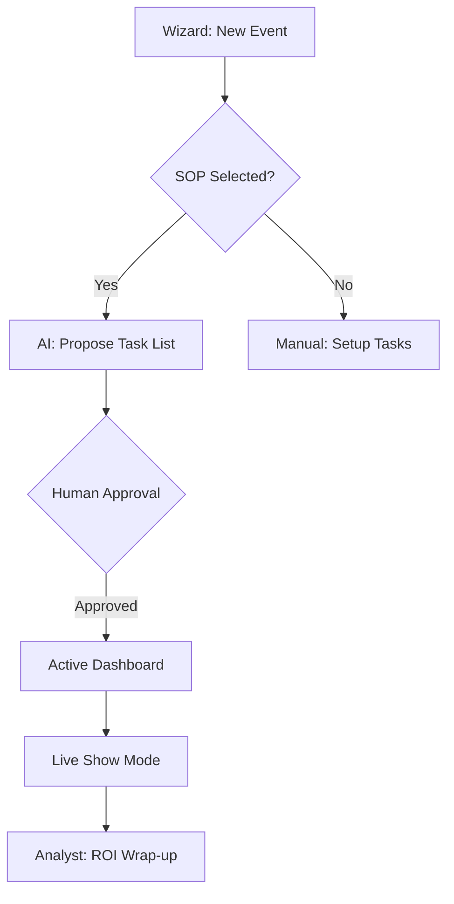
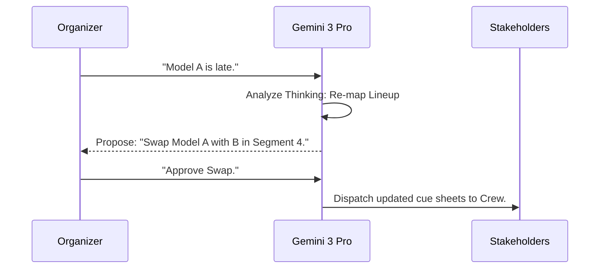

# 🎟️ FashionOS Events System: Orchestration Blueprint
**Architecture: Mandatory 3-Panel System (Context · Work · Intelligence)**

---

## 1. EXECUTIVE SUMMARY
The **FashionOS Events System** is the definitive command center for luxury activations, runway shows, and brand launches. In an industry where 5-minute delays cost thousands, the system provides a high-fidelity environment where human intuition and AI intelligence collaborate. By strictly enforcing the **3-Panel Mental Model**, it stabilizes operational chaos during peak pressure moments (e.g., Fashion Week).

---

## 2. EVENT TYPES SUPPORTED
- **Fashion Runway Shows**: Technical cues, model lineups, and press orchestration.
- **Brand Launch Events**: VIP guest management and sponsor activations.
- **Fashion Week Schedules**: Multi-show coordination across cities.
- **Private Buyer Previews**: Exclusive access and lead capture.
- **Sponsored Activations**: Direct ROI tracking for Beauty/Auto/Tech partners.
- **Media & Press Events**: Press kit distribution and interview scheduling.
- **Hybrid / Live-Streamed Events**: Integrated digital reach and engagement.

---

## 3. LEFT PANEL — Context & Navigation (EVENTS)
### PURPOSE
Provides the **Orientation Anchor**. It allows users to jump between different stakeholder views or specific event phases without losing focus on the current task.

### CONTENTS
- **Events Grid**: Filter by status (Draft / Planning / Live / Completed).
- **Stakeholder Registry**:
  - Maison Nodes (Designers/Brands)
  - Revenue Nodes (Sponsors)
  - Logistics Nodes (Venues/Vendors)
  - Media Nodes (Press/Influencers)
- **Omnichannel Calendar**: Cross-event timeline.
- **Neural Pulse**: Real-time notifications of stakeholder handshakes.
- **Concierge**: Quick-access strategy chat.

### INVARIANTS
- No editing or forms.
- No AI-triggered writes.
- Read-only navigation only.

---

## 4. MAIN PANEL — Work & Execution (EVENTS)
### PURPOSE
The **Human Action Center**. This is where organizers make high-stakes decisions, approve plans, and execute live show cues.

### CORE SCREENS
- **Events Dashboard**: Summary of readiness and critical path.
- **Run-of-Show (ROS) Editor**: 15-minute granularity with technical cues (Lighting, Audio, Screen).
- **Stakeholder Assignment**: Mapping roles to specific event segments.
- **Venue Layout HUD**: Interactive map of floor plans and load-in zones.
- **Vendor Task Board**: Dependency-based tracking for AV, Security, and Catering.
- **Live Mode**: The "Go-Button" interface for show-day execution.

### KEY RULE
All approvals and database commits happen exclusively in this panel.

---

## 5. RIGHT PANEL — Intelligence & AI Actions (EVENTS)
### PURPOSE
The **Strategic Partner**. It continuously monitors the work in the Main Panel to suggest optimizations and flag risks before they become catastrophes.

### CONTENTS
- **Strategic Forecasts**: "Predicting 20-minute delay due to current load-in velocity."
- **DNA Compliance Audit**: Ensuring sponsor placements match Brand DNA v2.1.
- **Neural Drafts**: Pre-generated vendor outreach and press pitches.
- **Optimization Suggestions**: "Suggesting 10-model buffer to minimize backstage friction."

### AI RULES
- **AI Proposes → Human Approves**: Zero silent automation.
- **Grounded Evidence**: Every suggestion cites a Playbook or Grounded Trend.

---

## 6. STAKEHOLDER SYSTEMS

| Stakeholder | Access Level | Primary Utility | AI Assistance |
| :--- | :--- | :--- | :--- |
| **Organizers** | Owner | Full Orchestration | Critical Path Recovery |
| **Brands** | Contributor | Lineup & DNA Lock | Storyteller (Copy) |
| **Sponsors** | External | Deliverable Tracking | ROI Forecaster |
| **Venues** | External | Logistics & Scheduling | Maps Grounding |
| **Vendors** | Task-Only | AV Cues & Checklists | Technical Briefs |
| **Media** | External | Press Kit Access | Narrative Synthesis |

---

## 7. EVENT PLANNING WORKFLOW

1. **Intake (Left/Main)**: Select "Runway SOP" ➔ Define Date & City.
2. **Strategy (Right)**: AI proposes 3 Grounded Venues via `googleMaps`.
3. **Commit (Main)**: Human approves Venue A ➔ Contract Link established.
4. **Orchestration (Main)**: Designers upload lineups ➔ AI generates initial ROS.
5. **Partnership (Main/Right)**: Sponsors onboarded ➔ AI audits placement compliance.
6. **Execution (Main)**: Live Mode active ➔ Technical cues dispatched to vendors.
7. **Attribution (Right)**: Analyst Agent generates post-show ROI for sponsors.

---

## 8. AI FEATURES (CORE VS ADVANCED)

### CORE (V1 — SYSTEM STABILITY)
- **Status Reasoning**: Explaining why an event is "At Risk."
- **Field Guardian**: Detecting missing contract signatures or unassigned tasks.
- **Timeline Validation**: Identifying overlapping model schedules.

### ADVANCED (V2+ — PRODUCTION SPEED)
- **ROS Architect**: Structured generation of technical cues from designer notes.
- **Delay Forecaster**: Real-time prediction of run-of-show slippage.
- **Sponsor Match Agent**: Deep search for partners with highest DNA affinity.

---

## 9. GEMINI 3 TOOLS MAPPING

- **Gemini 3 Pro**: Recursive reasoning for complex event schedules (`Thinking`).
- **Gemini 3 Flash**: Rapid cues and guest check-in vision scans.
- **Search Grounding**: Verifying vendor reputation and current media trends.
- **Maps Grounding**: Sourcing studios and coordinating logistics routes.
- **Structured Output**: Ensuring all ROS data is technical and valid JSON.
- **Native Audio**: Live voice concierge for stage managers.
- **RAG**: Grounding event plans in "NYFW Standard Playbooks."

---

## 10. EVENTS DATA MODEL

- **events**: `id, title, brand_id, venue_id, date, status_index`.
- **run_of_show**: `id, event_id, segment_title, start_time, technical_cues_json`.
- **event_tasks**: `id, event_id, stakeholder_id, dependency_id, status`.
- **event_sponsors**: `id, event_id, brand_id, contract_value, roi_forecast`.
- **event_guests**: `id, name, type (VIP/Media), checked_in_at`.

---

## 11. MERMAID DIAGRAMS

### 11.1 Flowchart: Event Logic

### 11.2 Sequence: AI Recovery Handshake

---

## 12. REAL-WORLD SCENARIOS
- **The Recovery**: Venue power failure detected ➔ AI identifies nearest rental gen-set via `googleMaps` ➔ Proposes logistical path ➔ Human approves.
- **The Sponsor Lock**: Sponsor logo placement in ROS ➔ Guardian Agent flags conflict with camera seating ➔ Suggests 5-degree shift ➔ Handshake complete.

---

## 13. SUCCESS METRICS
- **Readiness Score**: % of critical path cleared 48h before event.
- **ROS Accuracy**: Planned vs. Actual segment timing delta < 2%.
- **Sponsor ROI**: 100% deliverable fulfillment verified by AI vision.

---

## 14. RISKS & CONSTRAINTS
- **Sync Latency**: Multi-stakeholder coordination requires robust offline-first caching.
- **Hallucination**: AI suggesting venues that don't exist (Mitigated by Grounding).
- **Security**: VIP guest lists must be node-encrypted.

---

## 15. PHASED IMPLEMENTATION PLAN

### Phase 1 — Manual Core
- All 3 panels functional.
- Manual CRUD for Events, ROS, and Tasks.
- **Verification**: User can manually run a show night.

### Phase 2 — AI Assistant
- SOP-driven task generation.
- Basic status explanations in the Right Panel.
- **Verification**: -50% reduction in setup time.

### Phase 3 — AI-Driven Optimization
- Live Voice link for on-set cues.
- Deep ROI simulation and forecasting.
- **Verification**: Positive ROI delta in pilot sponsor reports.

---
**Status: Blueprint Operational.**