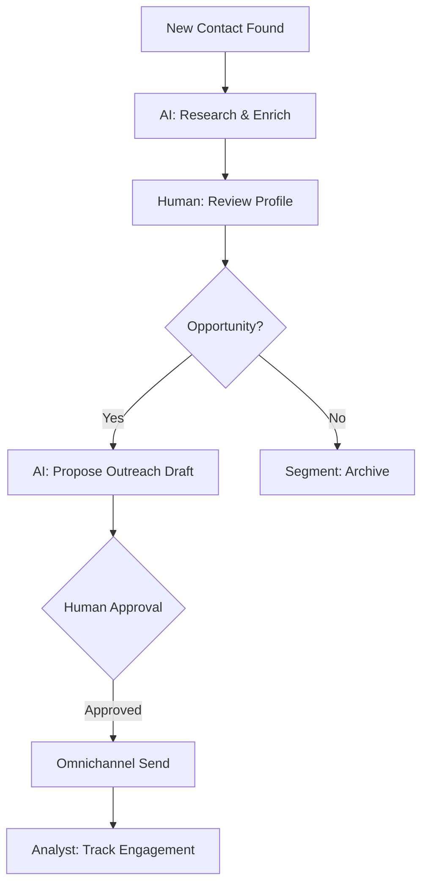
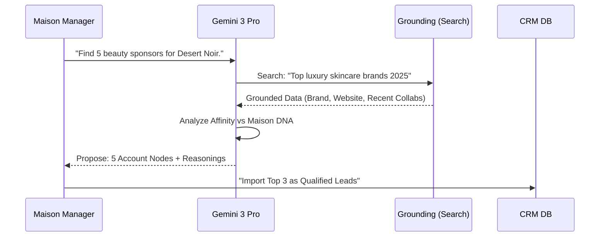

# 📇 FashionOS CRM System: Strategic Relationship Blueprint
**Status: Blueprint | Phase: End-to-End Orchestration**

---

## 🚀 PROGRESS TRACKER (CRM INFRASTRUCTURE)
| Task | Status | Proof / Validation |
| :--- | :---: | :--- |
| **CRM Data Model (Multi-tenant)** | ⚪ | Tables: contacts, accounts, deals, activities. |
| **3-Panel UI Layout (CRM Scope)** | ⚪ | Sidebar (Left), Tables (Main), AI Panel (Right). |
| **Messaging Layer (Email/WhatsApp)** | ⚪ | "Draft -> Approve -> Send" handshake logic. |
| **AI Enrichment Engine** | ⚪ | Gemini 3 Grounded Contact/Account profiles. |
| **Multi-Agent Orchestration** | ⚪ | Content/Comms + Analyst + Scorer nodes. |
| **Sponsorship Pipeline** | ⚪ | Stage-gated deal tracking with ROI forecast. |

---

## 1. EXECUTIVE SUMMARY
The **FashionOS CRM** is the definitive relationship hub for the modern Maison. It moves beyond static data storage to become an **Intelligence-Driven Outreach Engine**. By synchronizing contact metadata with **Gemini 3 Grounding** and **Maison Playbooks**, it empowers teams to secure high-value sponsorships, media placements, and wholesale deals with surgical precision.

---

## 2. ROUTE ARCHITECTURE (SEMANTIC GATING)

| Domain | Route Path | Access | Purpose |
| :--- | :--- | :--- | :--- |
| **App Core** | `/crm` | Auth | CRM Unified Dashboard |
| **App Core** | `/crm/contacts` | Auth | Global Contact Registry |
| **App Core** | `/crm/contacts/:contactId` | Auth | Contact 360 View |
| **App Core** | `/crm/accounts` | Auth | Company/Brand Registry |
| **App Core** | `/crm/deals` | Auth | Sponsorship & Sales Pipeline |
| **App Core** | `/crm/deals/:dealId` | Auth | Deal War Room |
| **App Core** | `/crm/conversations` | Auth | Omnichannel Thread Hub |

---

## 3. UI SCHEMA: THE TRIPTYCH CONSTITUTION

### 3.1 LEFT PANEL — Context & Orientation
- **Global Search**: Search Contacts, Accounts, or Deal IDs.
- **Segments**: "VIP Buyers", "Milan Media", "Beauty Sponsors", "Luxury Vendors".
- **Comms Pulse**: Indicator for unread threads (Email/WhatsApp).
- **Recent Activities**: Mini-feed of global relationship updates.

### 3.2 MAIN PANEL — Work & Action
- **List Mode**: Data tables with high-fidelity filters (Sentiment, Last Active, Deal Value).
- **360 View**: Tabbed interface: Overview | Activity Timeline | Deals | Related Contacts.
- **Message Composer**: Inline editor for drafting tailored outreach.
- **Pipeline Kanban**: Drag-and-drop Deal stages (Lead -> Pitch -> Contract -> ROI).

### 3.3 RIGHT PANEL — Intelligence & Agents
- **Neural Enrichment**: Proactive suggestions to update roles, bios, or market relevance via `googleSearch`.
- **Strategic Recommendation**: "Next Best Action" (e.g., "Pitch SS25 Desert Noir to this Editor").
- **Guardian Audit**: Checking if the proposed message aligns with Maison DNA v2.1.
- **ROI Forecast**: Predicted EMV/Sales lift for active sponsorships.

---

## 4. DATA MODEL (POSTGRES / SUPABASE)

- **contacts**: `id, brand_id, name, email, whatsapp, role, tags, sentiment_score, bio_grounded`.
- **accounts**: `id, brand_id, name, type (Sponsor/Buyer/Media), website, budget_tier`.
- **deals**: `id, account_id, title, stage_index, value_forecast, actual_roi`.
- **activities**: `id, type (Email/WA/Call), contact_id, content, metadata_json`.
- **ai_runs**: `id, agent_node, input_context, proposed_output, approval_status`.

---

## 5. AI INTELLIGENCE & ENRICHMENT

### 5.1 Tools Mapping
| Gemini 3 Tool | Use Case | Result |
| :--- | :--- | :--- |
| **Gemini 3 Pro** | **Strategy Agent** | Thinking 4k tokens to score sponsor affinity. |
| **Google Search** | **Enrichment Node** | Grounding bio/roles against latest WWD/Vogue news. |
| **URL Context** | **Account Node** | Scoping competitor brand sites for "Partnership Gaps." |
| **Structured Output**| **Handshake** | Validating that message drafts are technical JSON. |
| **RAG** | **Retriever Node** | Pulling "Outreach SOPs" from Maison Playbooks. |

---

## 6. MULTI-AGENT ORCHESTRATION

- **Orchestrator**: Routes intent (e.g., "Research this sponsor") to sub-agents.
- **Analyst**: Calculates Deal health and ROI probability.
- **Content/Comms**: Synthesizes Email/WhatsApp drafts using Verbal DNA pillars.
- **Controller**: Enforces the **Approval Gate**; prevents any message from being sent silently.

---

## 7. COMMUNICATION SYSTEM (EMAIL & WHATSAPP)

### 7.1 "Neural Draft" Workflow
1. **Trigger**: Deal moves to "Pitch" stage.
2. **AI Logic**: `Content Agent` pulls Brand DNA + Sponsor URL ➔ Synthesizes Draft.
3. **Intelligence Panel**: Renders draft with "Improve" or "Approve" actions.
4. **Approval Gate**: Human edits text ➔ Clicks "Dispatch."
5. **Execution**: System sends via API ➔ Activity timeline updates with "Sent."

---

## 8. WORKFLOWS & AUTOMATIONS

---

## 9. MERMAID DIAGRAMS

### 9.1 Sequence: Sponsor Discovery

---

## 10. PHASED IMPLEMENTATION PLAN

### Phase 1: Manual Core
- Full 3-panel UI for Contacts/Accounts.
- Manual activity logging and task management.
- **Checkpoint**: User can manually move a deal through stages.

### Phase 2: AI Enrichment (Grounded)
- Gemini 3 Flash summary of account websites via URL Context.
- Automated role detection for media contacts via `googleSearch`.
- **Checkpoint**: Profile "Enrich" button returns verifiable data with citations.

### Phase 3: Communication Bridge
- Integration of Email/WhatsApp drafting interface.
- Approval gate logic for all outbound Comms.
- **Checkpoint**: One-click "Approve & Send" updates CRM timeline.

### Phase 4: Proactive Intelligence
- "Deal at Risk" detection based on inactivity.
- Automated ROI forecasting for sponsors.
- **Checkpoint**: Analyst agent suggests "Salvage Strategy" for stale deals.

---
**Status: Blueprint Operational. Ready for CRM Infrastructure build.**