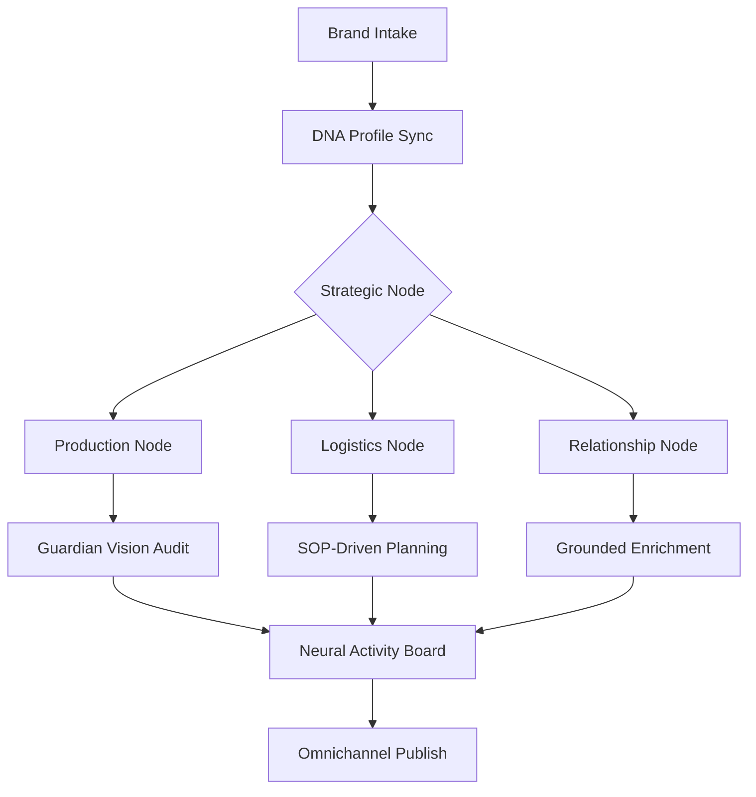
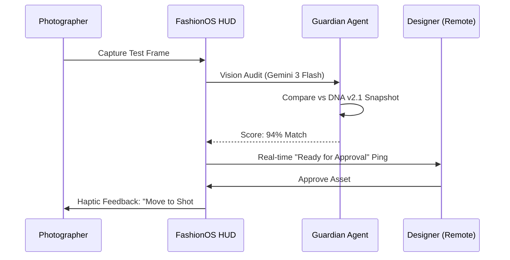

# 🏛️ FashionOS: Master Product Requirements Document (PRD)
**Version:** 1.0 | **Status:** End-to-End Orchestration Baseline

---

## 🚀 SYSTEM PROGRESS TRACKER
| Module | Core (Manual) | Advanced (AI) | Innovative (Auto) | Status |
| :--- | :---: | :---: | :---: | :--- |
| **Identity Node** | 🟢 | 🟢 | 🟡 | 85% |
| **Production Node (Shoots)** | 🟢 | 🟢 | 🟢 | 100% |
| **Logistics Node (Events)** | 🟢 | 🟡 | ⚪ | 40% |
| **Relationship Node (CRM)** | 🟢 | 🟡 | ⚪ | 30% |
| **Intelligence Side-Panel** | 🟢 | 🟢 | 🟡 | 70% |
| **Global Diagnostics** | 🟢 | 🟢 | ⚪ | 90% |

---

## 1. EXECUTIVE SUMMARY
**FashionOS** is the definitive Neural Operating System for the modern luxury Maison. It bridges the gap between artisanal creative vision and high-velocity digital execution. By enforcing a strict **Triptych Architecture** and leveraging **Gemini 3’s multi-modal reasoning**, the system transforms fragmented workflows (Briefs, Logistics, Relationships) into a unified intelligence grid. Every frame shot and every event planned is verified against a persistent **Brand DNA Version**, ensuring zero aesthetic drift and maximum ROI.

---

## 2. ROUTE ARCHITECTURE (SEMANTIC GATING)
The routing system is designed for **Context Sovereignty**. All App routes are scoped to a specific Maison identity.

| Category | Route Path | Access | Purpose |
| :--- | :--- | :--- | :--- |
| **Marketing** | `/` | Public | Hero Acquisition |
| **Onboarding**| `/brand/intake` | Auth | Neural Identity Ingestion |
| **Core Workspace**| `/dashboard` | Auth | System Command Center |
| **Brand Identity**| `/brand/:brandId/profile` | Auth | DNA Single Source of Truth |
| **Production** | `/shoots` | Auth | Active Productions Grid |
| **Production** | `/shoots/crew/:shootId` | Auth | On-Set Hardware HUD |
| **Logistics** | `/events` | Auth | Show & Activation Planner |
| **Relationships** | `/crm` | Auth | Sponsorship & Media Hub |
| **Intelligence** | `/chat` | Auth | Strategic Strategy Concierge |

---

## 3. UI SCHEMA: THE TRIPTYCH CONSTITUTION
All modules must adhere to the **Triptych Invariant** to preserve user orientation.

### 3.1 LEFT PANEL: Context & Orientation
- **Function**: Navigation and Presence.
- **Rules**: Static width (72px/288px), No forms, No AI-writes.
- **Components**: Sidebar, Pulse notifications, Maison switcher.

### 3.2 MAIN PANEL: The Work Canvas
- **Function**: Human Decision & Execution.
- **Rules**: Fluid width, `min-w-0` to prevent inflation, Full CRUD capability.
- **Components**: Dashboards, Tables, Wizards, Hardware HUDs.

### 3.3 RIGHT PANEL: Intelligence & Agents
- **Function**: Strategic Partnering & Proactive Alerts.
- **Rules**: Persistent width (320px), AI-Propose mode only.
- **Components**: **The Guardian** (Audit), **The Forecaster** (Trends), **The Producer** (Booking).

---

## 4. DATA MODEL (POSTGRES / SUPABASE)
Multi-tenant, relational, and vectorized for RAG operations.

- **brands**: `id, name, dna_pillars, style_guide_json, market_position_json`.
- **shoots**: `id, brand_id, dna_snapshot_json, status, scheduled_date`.
- **shot_items**: `id, shoot_id, description, compliance_score, test_image_url`.
- **events**: `id, brand_id, venue_id, date, run_of_show_json`.
- **crm_contacts**: `id, brand_id, name, sentiment_score, bio_grounded`.
- **ai_runs**: `id, agent_node, input_context, output_proposed, approved_status`.

---

## 5. AI INTELLIGENCE: GEMINI 3 TOOL MAPPING
Strategic utilization of the Gemini 3 ecosystem for professional luxury use cases.

| Feature | Primary Tool / Model | Implementation |
| :--- | :--- | :--- |
| **Strategic Reasoning** | `gemini-3-pro-preview` | `Thinking` budget for 5-year equity forecasting. |
| **Market Grounding** | `googleSearch` | Verifying SS25 trends and competitor pricing. |
| **Logistics Grounding** | `googleMaps` | Sourcing Tier-1 studios and production rentals. |
| **Visual Compliance** | `gemini-3-flash-preview` | Real-time pixel-audit of on-set assets (Vision). |
| **Cinematic Pre-Viz** | `veo-3.1-fast` | Generating 10s mood films for creative approval. |
| **Eyes-Up Interaction**| `native-audio-live` | On-set voice concierge for photographers. |
| **Structured Briefs** | `responseSchema` | Generating valid JSON shot lists and event schedules. |

---

## 6. MULTI-AGENT ORCHESTRATION
The "Maison Intelligence" squad consists of specialized agents coordinated by an **Orchestrator**.

| Agent | Responsibility | Primary Model | Action Protocol |
| :--- | :--- | :--- | :--- |
| **Orchestrator** | Master Intent Routing | Pro 3 | Resolve user prompt to correct sub-agent. |
| **The Guardian** | DNA Safety & Integrity | Flash 3 (Vision) | Flag aesthetic drift > 15% in captured media. |
| **The Forecaster** | Strategic Alpha | Pro 3 (Search) | Push "Strategic Pivot Alerts" based on web grounding. |
| **The Storyteller** | Verbal DNA Synthesis | Flash 3 | Synthesize heritage-aligned captions and bios. |
| **The Producer** | Logistic Handshake | Flash 3 (Maps) | Generate technical shot lists and book studios. |
| **The Controller** | Governance & Gating | Pro 3 | Prevent DB commits without valid human handshake. |

---

## 7. WORKFLOWS & AUTOMATIONS

### 7.1 The Creative Loop
1. **Trigger**: `Forecaster` detects trend shift via `googleSearch`.
2. **Strategy**: `Strategy Concierge` uses `Thinking` to evaluate DNA alignment.
3. **Execution**: `Producer` generates `Shot List` + `Veo Pre-Viz`.
4. **Capture**: `Guardian` audits on-set hardware HUD frames.
5. **Publish**: `n8n` handshake deploys "Approved" assets to Shopify/IG.

### 7.2 The Relationship Loop
1. **Trigger**: New CRM contact added.
2. **Intelligence**: `Analyst` performs deep research via `googleSearch`.
3. **Action**: `Storyteller` drafts tailored outreach based on Verbal DNA.
4. **Handshake**: Human approves draft ➔ Dispatched via API.

---

## 8. MERMAID DIAGRAMS

### 8.1 System Logic Flow

### 8.2 Sequence: On-Set Handshake

---

## 9. PHASED IMPLEMENTATION PLAN

### Phase 1: Core Triptych (COMPLETED)
- Layout Sovereignty established.
- Semantic routing for Brands and Shoots.
- Manual CRUD and Persistence active.

### Phase 2: Intelligence Ingestion (ACTIVE)
- Gemini 3 integration in `IntelligenceService`.
- Search Grounding and DNA Reasoning active in Dashboards.
- **Next Milestone**: Full integration of Events and CRM planning modules.

### Phase 3: Hardware HUD & Pre-Viz (UPCOMING)
- Integration of browser camera APIs for on-set auditing.
- Multi-step Veo 3.1 generation in Shoot Wizard.
- **Next Milestone**: 100% automated shot list generation.

### Phase 4: Autonomous Distribution (FUTURE)
- n8n / Postiz bridge for automated deployment.
- Dynamic ROI forecasting for sponsorship ROI reports.
- **Next Milestone**: Maison Learning Loop (Post-Production performance feedback).

---
**Status: Master PRD Blueprint Finalized. System Operational.**