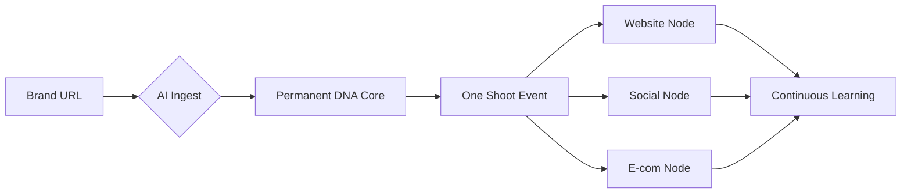

# 🌍 FashionOS: Marketing Website & Conversion Strategy
**Status: Blueprint | Phase: Market Acquisition Baseline**

---

## 🚀 MARKETING PROGRESS TRACKER
| Page / Route | Status | Purpose | Primary CTA |
| :--- | :---: | :--- | :--- |
| **Landing** (`/`) | 🟢 | Value Prop & Conversion | Create Brand Profile |
| **Features** (`/features`) | 🟢 | Capability Deep-Dive | Request Demo |
| **How It Works** (`/how-it-works`) | ⚪ | System Narrative | Start Free Trial |
| **Solutions Hub** (`/solutions`) | 🟢 | Vertical Categorization | View Tiers |
| **Services Hub** (`/services`) | 🟢 | Talent Marketplace | Book Slot |
| **Sectors** (`/sectors/*`) | ⚪ | Industry Specificity | Request Diagnostic |
| **Sponsorships** (`/sponsors`) | 🟢 | Revenue Node Acquisition | Partner With Us |
| **Pricing** (`/pricing`) | 🟢 | Investment Transparency | Choose Plan |
| **About** (`/about`) | 🟢 | Heritage & Vision | Join Collective |
| **Blog** (`/blog`) | 🟢 | Strategic Intel | Subscribe Node |
| **Platform Sitemap** (`/overview`) | 🟢 | Visual Orientation | Enter App |

---

## PROMPT 1 — MARKETING SITE MASTER PLAN (FOUNDATION)
### ROLE
You are a **Principal Product Marketer + UX Strategist + Systems Thinker**.

### TASK
Create a **complete plan** for the FashionOS marketing website that:
- Explains the product simply: "One Shoot, All Channels."
- Shows how the Triptych system works end-to-end.
- Converts luxury stakeholders into high-fidelity demos.

### OUTPUT
1) Site goals & conversion strategy.
2) Sitemap (Marketing-only nodes).
3) Primary CTAs mapped to user lifecycle.
4) Content tone: Sophisticated, Precise, Architectural.

---

## PROMPT 2 — ROUTES & SITEMAP (PUBLIC DOMAIN)
### ROLE
You are a **Frontend Architect + SEO Strategist**.

### TASK
Define the public-facing route table for FashionOS.

| Route | Purpose | SEO Keyword Target |
| :--- | :--- | :--- |
| `/` | Hero Entry | Fashion Operating System |
| `/solutions/events` | Show Planning | Runway Management Software |
| `/solutions/shoots` | Production Node | Fashion Shoot Planning Tool |
| `/sponsors` | Partnership Hub | Luxury Brand Sponsorships |
| `/platform-overview` | System Visibility | AI Fashion Technology |

---

## PROMPT 3 — PAGE-BY-PAGE CONTENT STRUCTURE
### ROLE
You are a **Conversion Copywriter + UX Designer**.

### TASK
For EACH marketing page, define the component stack.
- **Hero**: Emotional value prop + Action.
- **Process**: 3-step neural handshake (Ingest -> Plan -> Deploy).
- **Features**: Visual grid of AI Agents (Guardian, Forecaster, Storyteller).
- **Proof**: Metrics (e.g., -80% Pre-Viz costs).
- **Sticky Progress Tracker**: Top-of-page visual: Problem ✅ Solution ✅ Proof ⏳ Action 🚀.

---

## PROMPT 4 — VISUALS & CHARTS STRATEGY
### ROLE
You are a **Visual Systems Designer**.

### TASK
Define the visual language for the public domain.
- **Hero Assets**: Grayscale fashion imagery with Sage (#8FAE9E) highlights.
- **System Diagrams**: High-contrast "Neural Maps" showing data flow from Brand DNA to Shopify.
- **KPI Visuals**: Simple, clinical charts for Reach and ROI.
- **Mermaid Usage**: Use flowcharts to explain the "Approval Gate" logic to non-technical founders.

---

## PROMPT 5 — “HOW IT WORKS” PAGE (SYSTEM NARRATIVE)
### ROLE
You are a **Product Educator**.

### TASK
Design the `/how-it-works` page as a linear narrative.
1. **The Fracture**: Show the current chaos of Notion/WhatsApp/Email.
2. **The Sync**: Introduce the Brand Profile as the "Neural Anchor."
3. **The Orchestration**: How the 3-Panel system manages Events and Shoots.
4. **The Deployment**: Automated routing to Social and E-com nodes.
5. **The Feedback**: How the system learns from actual engagement metrics.

---

## PROMPT 6 — SERVICES & SECTORS PAGES
### ROLE
You are a **B2B Growth Marketer**.

### TASK
Create targeted landing pages for industry verticals.
- **Beauty**: Focus on "Neural Fragrance Audits" and "Texture Accuracy."
- **Automotive**: Focus on "Aesthetic Fusion" and "High-HNW Placement."
- **Services (Photography)**: Focus on "Hardware HUD" and "One-Page Briefs."
- **Internal Linking**: Every Sector page must link to a relevant Service package.

---

## PROMPT 7 — SPONSORSHIPS & PARTNERS PAGES
### ROLE
You are a **Sponsorship Strategist**.

### TASK
Design the Partnership vertical hub.
- **Value Prop**: "Trackable ROI for the first time in high-end fashion."
- **The Dashboard**: Preview the ROI Simulator for sponsors.
- **The Guardian**: Explain how the AI ensures sponsor brand safety during live shows.

---

## PROMPT 8 — MARKETING WIZARDS & CHATBOTS (PUBLIC)
### ROLE
You are a **UX + AI Product Designer**.

### TASK
Design lead-generation tools for the public site.
- **Wizard**: "Is FashionOS right for me?" — 4 questions ➔ ROI Projection.
- **Chatbot**: "The Strategist" — Answers "How does Veo 3.1 work?" and "What are the pricing tiers?" ➔ Routes to Demo Page.
- **Safety**: Public AI nodes must NEVER access the `ProjectContext` or Maison DNA tables.

---

## PROMPT 9 — MERMAID DIAGRAMS (MARKETING)
### TASK
Provide visual system flows for the "Features" and "How It Works" pages.

---

## PROMPT 10 — PHASED BUILD PLAN + VALIDATION
### ROLE
You are a **Delivery Lead**.

### TASK
1. **Phase 1 (Core)**: Landing, Features, Pricing.
2. **Phase 2 (Content)**: How it Works, Solutions, About.
3. **Phase 3 (Nodes)**: Sponsors, Services, Sectors.
4. **Phase 4 (Interactive)**: Public Wizards, Blog.
**Validation**: Every page must score > 90 on Desktop/Mobile Lighthouse scores.

---
**Status: Marketing Blueprint Finalized. Ready for Component Generation.**