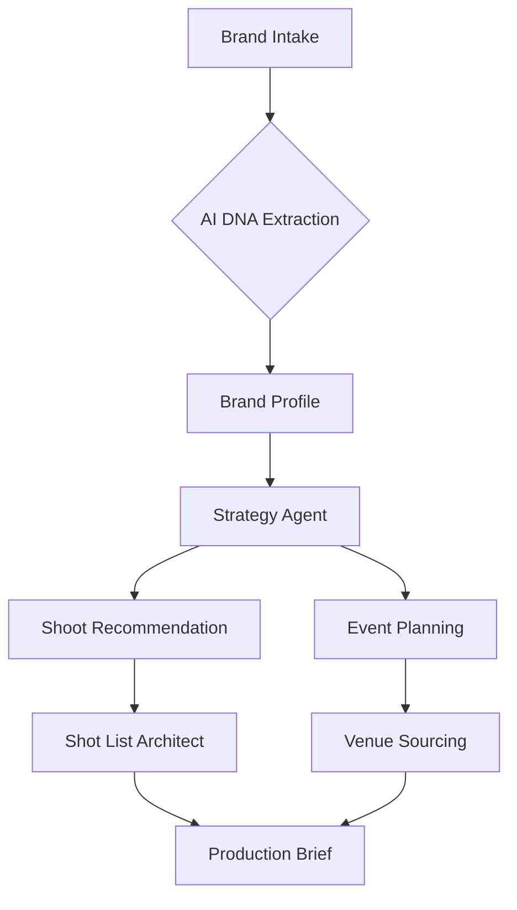
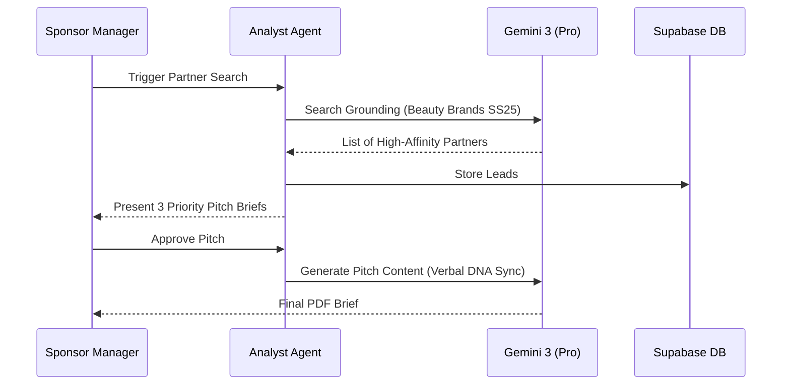

# FashionOS — Product Requirements Document (PRD) v1.0
**The Neural Operating System for the Modern Maison.**

---

## TABLE OF CONTENTS
1. [Executive Summary](#1-executive-summary)
2. [Problem Statement](#2-problem-statement)
3. [Target Users](#3-target-users)
4. [Directory Structure & Routes](#4-directory-structure--routes)
5. [Core Features (Manual)](#5-core-features)
6. [Advanced Features (AI)](#6-advanced-features)
7. [Use Cases](#7-use-cases)
8. [User Stories](#8-user-stories)
9. [User Journeys](#9-user-journeys)
10. [Workflows](#10-workflows)
11. [Mermaid Diagrams](#11-mermaid-diagrams)
12. [Website Pages](#12-website-pages)
13. [Dashboard Pages](#13-dashboard-pages)
14. [Wizards](#14-wizards)
15. [Chatbots & Conversational UI](#15-chatbots)
16. [Data Model](#16-data-model)
17. [AI Functions & Gemini 3 Usage](#17-ai-functions)
18. [AI Agents & Automations](#18-ai-agents)
19. [Success Criteria](#19-success-criteria)
20. [Risks + Constraints](#20-risks--constraints)
21. [Suggested Improvements](#21-suggested-improvements)
22. [Implementation Notes](#22-implementation-notes)
23. [Phased Implementation Plan](#23-phased-implementation-plan)

---

## 1. EXECUTIVE SUMMARY
FashionOS is a high-fidelity operating system designed for luxury fashion brands and event producers. It synchronizes brand DNA with operational execution across CRM, event orchestration, sponsorship management, and multi-channel production. By leveraging Gemini 3, FashionOS provides a "Neural Partner" that automates administrative friction while preserving artisanal integrity.

---

## 2. PROBLEM STATEMENT
Fashion brands currently operate using fragmented silos (Notion for briefs, HubSpot for sales, spreadsheets for events, and WhatsApp for crews).
- **DNA Fragmentation**: Brand identity is lost between strategy and set.
- **Logistical Friction**: Event and shoot planning takes weeks of manual coordination.
- **Data Blindness**: Sponsors and media partners are managed via gut feeling rather than performance signals.
- **Standard Tools Fail**: Generic CRMs don't understand "Aesthetic Compliance" or "Luxury Nuance."

---

## 3. TARGET USERS
| Role | Goal |
| :--- | :--- |
| **Fashion Designers** | Protect brand DNA while scaling production. |
| **Creative Directors** | Orchestrate high-fidelity shoots and cinematic campaigns. |
| **Event Producers** | Manage shows, guest lists, and venue logistics. |
| **Sponsorship Managers** | Identify, pitch, and track luxury partnerships. |
| **Media & PR Teams** | Distribute grounded press kits to global outlets. |
| **Executives / Founders** | Monitor Maison growth velocity and brand equity. |

---

## 4. DIRECTORY STRUCTURE & ROUTES

### 4.1 Frontend Directory Structure
```text
/
├── components/
│   ├── ui/                 # Atomic primitives
│   ├── layouts/            # Public, App, FullWidth
│   └── shared/             # SEO, Nav, Footer
├── pages/
│   ├── marketing/          # Landing, Pricing, Solutions
│   ├── sponsors/           # Partnership hubs
│   └── app/                # Authenticated Workspace
│       ├── brand/          # Identity nodes (:brandId)
│       ├── crm/            # Relationships (:contactId)
│       ├── events/         # Show orchestration (:eventId)
│       ├── production/     # Shoots & Video (:shootId)
│       └── global/         # Dash, Settings, Chat
├── services/               # AI Handshakes (Gemini, Veo)
├── contexts/               # Project, Intelligence, CRM state
└── docs/                   # Governance & PRD
```

### 4.2 Semantic Routing
- `/dashboard`
- `/brand/:brandId/profile`
- `/crm/contacts/:contactId`
- `/events/:eventId/logistics`
- `/shoots/brief/:shootId`
- `/sponsors/deals/:sponsorId`

---

## 5. CORE FEATURES (NO AI)
Manual features required as the functional baseline.

| Feature | Description | Screen | Example |
| :--- | :--- | :--- | :--- |
| **Brand Profile** | Identity source-of-truth. | `BrandProfile` | Manage mission, logos, and color codes. |
| **CRM Hub** | Contact and account management. | `CRMContacts` | Tracking influencer outreach status. |
| **Event Planner** | Schedule and task tracker for shows. | `EventLogistics` | Managing NYFW venue load-in times. |
| **Asset Board** | File storage and categorization. | `MediaBoard` | Repository for RAW shoot frames. |
| **Sponsor Deals** | Pipeline for partnership revenue. | `SponsorHub` | Tracking a contract with a luxury car brand. |

---

## 6. ADVANCED FEATURES / AI FEATURES
Neural enhancements powered by Gemini 3.

| Feature | Problem Solved | Gemini Tool Used |
| :--- | :--- | :--- |
| **AI Shoot Wizard** | Manual brief writing is slow. | `G3 Pro + Veo 3.1` |
| **AI CRM Insights** | Sales leads lack context. | `Search Grounding + Thinking` |
| **AI Event Scheduler** | Scheduling conflicts in multi-city tours. | `Interactions API + Code Exec` |
| **AI Sponsor Match** | Identifying non-obvious brand partners. | `Deep Research + RAG` |
| **Aesthetic Audit** | Human error in brand consistency. | `Flash 3 (Vision)` |

---

## 7. USE CASES
- **Independent Designer**: Uses the Brand Intake to build a professional identity and a 40-item shoot list in 10 minutes.
- **Fashion Week Organizer**: Uses AI Show Planning to coordinate 12 venues and 500+ media guests with real-time conflict detection.
- **Sponsor (Beauty)**: Analyzes "Aesthetic Drift" to ensure their product placement in a shoot matches their own high-fidelity standards.

---

## 8. USER STORIES
- **CRM**: As a Brand Manager, I want AI to summarize my last 3 years of email history with a media outlet, so I can pitch them a personalized SS25 exclusive.
- **Events**: As an Event Producer, I want to voice-command venue adjustments during a show, so I can stay hands-on with the models.
- **Shoots**: As a Photographer, I want real-time DNA compliance scores for my frames, so I don't have to reshoot later.

---

## 9. USER JOURNEYS
1. **Maison Onboarding**: Intake ➔ DNA Extraction ➔ Market Position Map ➔ Persona Architecture.
2. **Sponsorship Pipeline**: Market Gap Detection ➔ Grounded Sponsor Search ➔ AI Pitch Generation ➔ Deal Tracking.
3. **Show Execution**: Concept Gen ➔ Venue Sourcing ➔ Casting ➔ Live Show Cues ➔ Automated Press Kit.

---

## 10. WORKFLOWS
### 10.1 AI-Assisted Event Workflow
- **Trigger**: New event created in `/brand/events`.
- **AI Action**: Planner Agent sources 3 venues via `googleMaps` grounding based on "Minimalist" DNA.
- **Gate**: Human selects venue; AI then generates a 12-week task list.
- **Output**: Synced calendar nodes for the whole production team.

---

## 11. MERMAID DIAGRAMS

### 11.1 Flowchart: Identity-to-Production


### 11.2 Sequence Diagram: Sponsorship Handshake


---

## 12. WEBSITE PAGES (MARKETING)
- **Landing**: Hero (One Shoot, Every Channel), Problem/Solution, Features.
- **Solutions**: Events, Shoots, CRM verticals.
- **Pricing**: Maison, Collective, Heritage tiers.
- **Demo**: Interactive "Diagnostic" form to see AI in action.

---

## 13. DASHBOARD PAGES (WORKSPACE)
- **Brand**: Identity core, DNA Pillars, Personas.
- **CRM**: Dynamic contact list, "Recent Strategic Insights" feed.
- **Events**: Visual show timeline, Logistics HUD, Guest Sentiment.
- **Shoots**: Active production hub, Hardware HUD (on-set).
- **Analytics**: Composite DNA Index, Drift Tracking, ROI Forecast.

---

## 14. WIZARDS (MULTI-STEP)
| Wizard | Step 1 | Step 2 | Step 3 | Output |
| :--- | :--- | :--- | :--- | :--- |
| **Brand Intake** | URL/Mission | Persona Select | DNA Pillars | Brand Profile |
| **Shoot Planning** | Concept Select | Pre-Viz Video | Shot List Gen | Production Brief |
| **Event Creator** | Intent/Goals | Venue Source | Logistics Sync | Task Timeline |

---

## 15. CHATBOTS & CONVERSATIONAL UI
- **Concierge**: Floating bubble on all pages; handles strategy Q&A.
- **On-Set Assistant**: Native Audio link; provides eyes-free feedback on lighting/pose.
- **CRM Assistant**: Summarizes relationships and generates pitch drafts.
- **Gate**: Chatbots can *propose* data updates, but never `commit` without human "Verify & Save."

---

## 16. DATA MODEL
| Table | Key Fields | Relationships |
| :--- | :--- | :--- |
| **Brand** | id, name, description, dna_pillars (array) | 1:N Shoots, 1:N Events |
| **Contact** | id, name, email, sentiment_score, tags | N:1 Account |
| **Event** | id, brand_id, venue_id, date, status | 1:N Tasks, 1:N Guests |
| **Asset** | id, shoot_id, storage_url, compliance_score | N:1 Shoot |
| **Sponsorship**| id, brand_id, sponsor_name, value, phase | N:1 Brand |

---

## 17. AI FUNCTIONS & GEMINI 3 USAGE
- **Gemini 3 Pro**: Deep reasoning on brand strategy (`Thinking`).
- **Gemini 3 Flash**: Rapid aesthetic audits and captioning.
- **Search Grounding**: Real-time trend and competitor verification.
- **Maps Grounding**: Physical studio and venue sourcing.
- **Veo 3.1**: Campaign pre-viz video generation.
- **Structured Output**: Consistent JSON for shot lists and CRM leads.

---

## 18. AI AGENTS & AUTOMATIONS
| Agent | Role | Gemini Model | Actions |
| :--- | :--- | :--- | :--- |
| **Orchestrator** | Master Task Router | G3 Pro | Routes user intent to sub-agents. |
| **Guardian** | Compliance Auditor | G3 Flash (Vision)| Scores pixels vs DNA pillars. |
| **Forecaster** | Trend Pulse | G3 Pro (Search) | Pushes strategic pivot alerts. |
| **Storyteller** | Verbal DNA | G3 Flash | Synthesizes premium copy. |
| **Controller** | Approval Gate | G3 Pro | Validates data integrity before DB save. |

---

## 19. SUCCESS CRITERIA
- **Production Efficiency**: 40% reduction in pre-viz and brief creation time.
- **CRM Velocity**: 2x increase in media placement conversion rates.
- **Aesthetic Integrity**: < 5% variance in brand consistency across 12 months.
- **Event Success**: 95%+ completion of critical path tasks before call-time.

---

## 20. RISKS + CONSTRAINTS
- **AI Hallucination**: AI suggesting non-existent venues or studios. (Mitigated by Grounding).
- **Data Privacy**: Leakage of unreleased collection designs. (Mitigated by Node-level encryption).
- **Compliance Drift**: AI model shifts causing brand aesthetic change. (Mitigated by DNA Version Locking).

---

## 21. SUGGESTED IMPROVEMENTS (V2+)
- **Marketplace**: Direct "One-Click Hire" for photographers inside the Shoot Wizard.
- **Autonomous Press Kits**: AI-generated editorial magazines from every event.
- **3D Set Simulator**: Digital twin of venues for lighting tests.

---

## 22. IMPLEMENTATION NOTES
- **Frontend**: Vite + React + Tailwind + HashRouter (for stability).
- **State**: React Context for Brand/Intelligence; local storage for persistence.
- **AI**: Google GenAI SDK (latest). Exclusively client-side for v1, proxying to Edge Functions in production.

---

## 23. PHASED IMPLEMENTATION PLAN

### Phase 1: Core (Manual)
- Focus: Brand Profiles, Manual Shoots, Manual CRM.
- Goal: Functional CRUD application with Luxury UI.

### Phase 2: AI-Assisted
- Focus: Intake DNA Extraction, AI Captions, Search Grounding.
- Goal: AI reduces manual typing for the user.

### Phase 3: AI-Driven (The Vision)
- Focus: Veo 3.1 Pre-Viz, Native Audio Live Link, Autonomous CRM leads.
- Goal: System proactively manages the brand.

---
**End of PRD.**